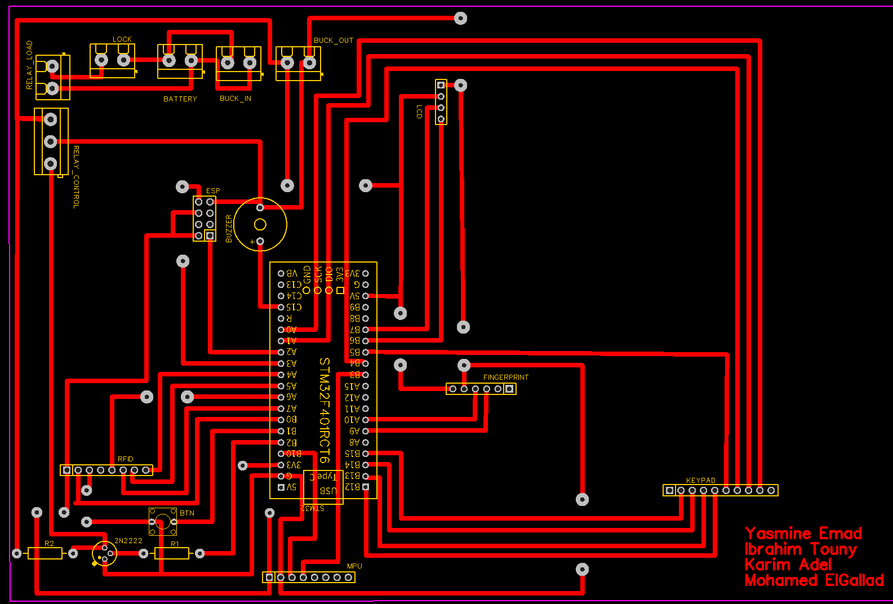
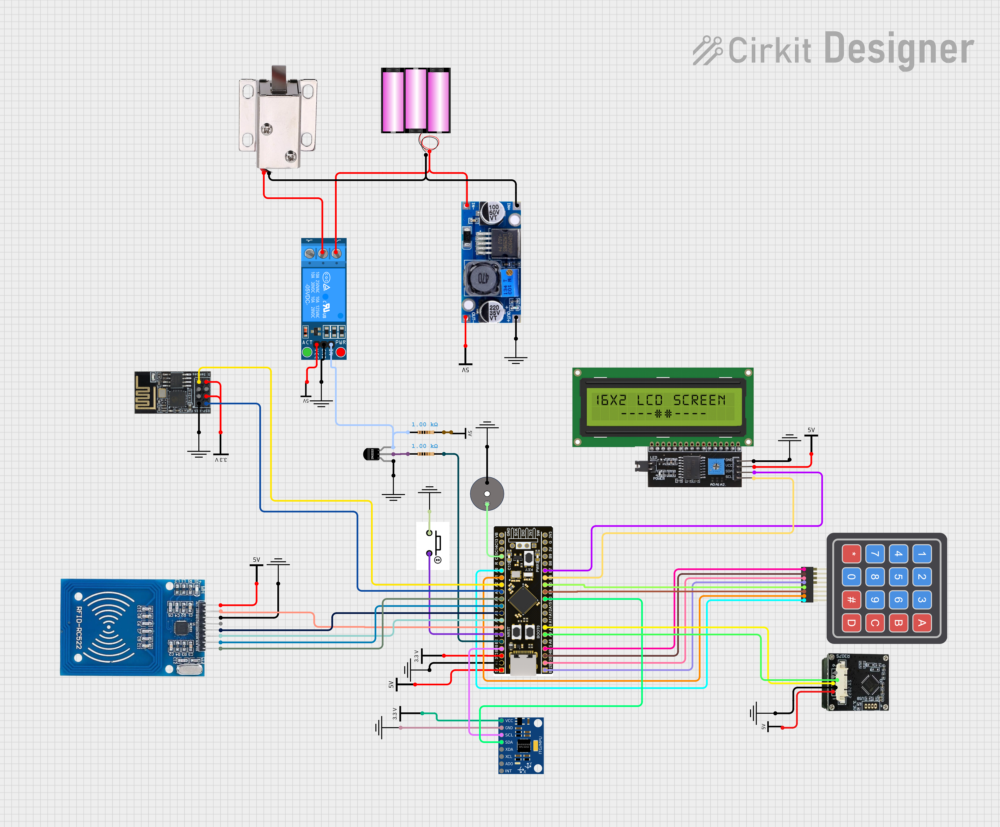

# LockEn — STM32 Multi-Factor Electronic Safe

**Team:** Yasmine Emad · Ibrahim Touny · Karim Adel · Mohamed ElGallad

## Table of Contents

1. [Project Overview](#1-project-overview)
2. [Hardware](#2-hardware)
   - 2.1 [Components](#21-components)
   - 2.2 [Power Architecture](#22-power-architecture)
   - 2.3 [Solenoid Drive Circuit](#23-solenoid-drive-circuit)
   - 2.4 [Pin Assignment](#24-pin-assignment)
   - 2.5 [PCB](#25-pcb)
3. [Firmware Architecture](#3-firmware-architecture)
   - 3.1 [System Clock](#31-system-clock)
   - 3.2 [FreeRTOS Tasks](#32-freertos-tasks)
   - 3.3 [Inter-task Communication](#33-inter-task-communication)
   - 3.4 [Authentication State Machine](#34-authentication-state-machine)
   - 3.5 [Keypad Layout and Key Functions](#35-keypad-layout-and-key-functions)
   - 3.6 [Credential Storage](#36-credential-storage)
   - 3.7 [Sleep Management](#37-sleep-management)
   - 3.8 [Wi-Fi and Remote Logging](#38-wi-fi-and-remote-logging)
4. [Folder Structure](#4-folder-structure)
5. [Test Plan](#5-test-plan)
   - 5.1 [Scope](#51-scope)
   - 5.2 [Normal Flow Tests](#52-normal-flow-tests)
   - 5.3 [Edge Case Tests](#53-edge-case-tests)
   - 5.4 [Failure / What-If Tests](#54-failure--what-if-tests)
   - 5.5 [Security Tests](#55-security-tests)

---

## 1. Project Overview

LockEn is an electronic safe built on the STM32F401RCT6 microcontroller. It requires **two out of four** authentication factors before releasing the solenoid lock. The four supported factors are RFID card, fingerprint, PIN keypad, and face recognition (via Wi-Fi to a laptop running a Python server). If the device is physically moved, an MPU6050 accelerometer/gyroscope detects the tamper and triggers an alarm. All authentication events are logged remotely over Wi-Fi.

Credentials are stored in internal flash memory (Sector 5) and survive power loss. They can only be wiped by holding the reset button, which is located inside the safe alongside all other components — the button can therefore only be pressed when the safe is already unlocked.

The firmware runs FreeRTOS with six concurrent tasks. All application logic is task-based; `main.c` only initialises peripherals and starts the scheduler.

---

## 2. Hardware

### 2.1 Components

| # | Component | Role | Key Specification | Price (EGP) |
|---|-----------|------|-------------------|-------------|
| 1 | STM32F401RCT6 | Main MCU | 84 MHz, 256 KB flash, 64 KB RAM, LQFP-64 | 240 |
| 2 | RC522 (MFRC522) | RFID reader | 13.56 MHz, SPI interface, reads ISO 14443-A cards | 110 |
| 3 | R307 | Fingerprint sensor | UART, 57600 baud, stores up to 256 templates | 900 |
| 4 | 3S LiPo Battery | Power source | 11.1 V nominal, feeds buck converter and solenoid | - |
| 5 | LM2596S | Buck converter | Steps 11.1 V to 5 V; powers LCD, fingerprint sensor, and MCU | 55 |
| 6 | 5 V Relay | Solenoid switch | Coil powered by 5 V; contacts switch 11.1 V to solenoid | 35 |
| 7 | Solenoid Door Lock | Physical lock | 12 V solenoid; energised = unlocked for 3 s | 240 |
| 8 | 4x4 Matrix Keypad | PIN entry and shortcuts | 16 keys; rows driven, columns read with pull-ups | 140 |
| 9 | LCD 16x2 I2C | User display | PCF8574 I2C backpack, address 0x4E, powered from 5 V rail | 120 |
| 10 | ESP8266 | Wi-Fi module | SoftAP mode + TCP client; UART 115200 baud; powered from MCU 3.3 V | 170 |
| 11 | MPU6050 | Tamper detection | Accelerometer + gyroscope, I2C, address 0x68; powered from MCU 3.3 V | 125 |
| 12 | 2N2222 | NPN transistor | Switches relay coil (5 V) using STM32 GPIO (3.3 V logic) | 1 |
| 13 | 2x 1 kOhm Resistor | Current limiters | R1: RFID reset pull-up; R2: 2N2222 base resistor | 2 |
| 14 | Active Buzzer | Audio feedback | Driven between MCU GPIO (PC15) and GND; beep patterns for OK/denied/alarm | 7 |
| 15 | 2-pin Button | Admin reset | Located inside the safe; held at boot to wipe credentials and re-run setup | 3 |

### 2.2 Power Architecture

```
3S LiPo (11.1 V)
     |
     +──────────────────────────────────────+
     |                                      |
     v                                      v
LM2596S Buck Converter                Relay contacts (load side)
     |                                      |
     v (5 V)                                v
     +──────────────────+            Solenoid (12 V rated,
     |                  |            works on 11.1 V)
     v                  v
  LCD (16x2)     Fingerprint (R307)
     |
     v
  STM32 MCU board (onboard 3.3 V LDO)
     |
     +──────────────────+──────────────────+
     |                  |                  |
     v                  v                  v
  RC522 RFID         MPU6050        ESP8266 (VCC + EN)
```

**Buzzer:** Connected between MCU GPIO pin (PC15) and GND. Activated when the pin is driven HIGH by the firmware.

### 2.3 Solenoid Drive Circuit

The STM32 GPIO (3.3 V logic) cannot drive a 5 V relay coil directly. A 2N2222 NPN transistor acts as a low-side switch:

```
PB2 ──► 1 kOhm (R2) ──► 2N2222 Base
                              |
                         Emitter ──► GND
                         Collector ──► Relay Coil ──► 5 V (from buck)
                                            |
                                      Flyback Diode (1N4007)
                                        across coil

Relay NO contacts:
  11.1 V (battery) ──► Solenoid ──► GND   (closes when relay energises)
```

When PB2 goes HIGH the transistor saturates, the relay coil energises, the contacts close, and 11.1 V is applied to the solenoid. The firmware holds this for 3 seconds then de-energises.

### 2.4 Pin Assignment

| Peripheral | Signal | STM32 Pin | Interface / Config |
|------------|--------|-----------|-------------------|
| RC522 RFID | SCK | PA5 | SPI1, 10.5 MHz, CPOL=0, CPHA=1 |
| RC522 RFID | MISO | PA6 | SPI1 |
| RC522 RFID | MOSI | PA7 | SPI1 |
| RC522 RFID | CS (NSS) | PA4 | GPIO output (software NSS) |
| RC522 RFID | RST | PB0 | GPIO output |
| R307 Fingerprint | TX (STM to sensor RX) | PA9 | UART1, 57600, 8N1 |
| R307 Fingerprint | RX (sensor TX to STM) | PA10 | UART1 |
| LCD I2C (PCF8574) | SCL | PB6 | I2C1, 100 kHz |
| LCD I2C (PCF8574) | SDA | PB7 | I2C1 |
| MPU6050 | SCL | PB10 | I2C2, 100 kHz |
| MPU6050 | SDA | PB3 | I2C2 |
| ESP8266 | TX (STM to ESP RX) | PA2 | UART2, 115200, 8N1 |
| ESP8266 | RX (ESP TX to STM) | PA3 | UART2 |
| Keypad Row 1 | R1 | PB15 | GPIO output |
| Keypad Row 2 | R2 | PB14 | GPIO output |
| Keypad Row 3 | R3 | PB13 | GPIO output |
| Keypad Row 4 | R4 | PB12 | GPIO output |
| Keypad Col 1 | C1 | PB5 | GPIO input, pull-up |
| Keypad Col 2 | C2 | PB4 | GPIO input, pull-up |
| Keypad Col 3 | C3 | PA1 | GPIO input, pull-up |
| Keypad Col 4 | C4 | PA0 | GPIO input, pull-up |
| Solenoid (via 2N2222 + relay) | Control | PB2 | GPIO output |
| Active Buzzer | Control | PC15 | GPIO output |
| Reset Button | Input | PB1 | GPIO input, pull-up (active LOW) |
| Status LED | Output | PC13 | GPIO output |


### 2.5 PCB

The PCB was designed in Cirkit Designer. All connectors are labelled on the silkscreen: `RELAY_LOAD`, `LOCK`, `BATTERY`, `BUCK_IN`, `BUCK_OUT`, `LCD`, `ESP`, `BUZZER`, `RFID`, `BTN`, `MPU`, `FINGERPRINT`, `KEYPAD`, `RELAY_CONTROL`.

**PCB Layout**



**Schematic (Cirkit Designer)**



---

## 3. Firmware Architecture

### 3.1 System Clock

The MCU runs at **84 MHz** derived from the internal HSI oscillator through the PLL (PLLM=8, PLLN=84, PLLP=2). APB1 is clocked at 42 MHz, APB2 at 84 MHz. TIM5 is used as the FreeRTOS tick source.

### 3.2 FreeRTOS Tasks

| Task | File | Stack | Priority | Role |
|------|------|-------|----------|------|
| AuthTask | `Tasks/auth_task.c` | 2 KB | Normal | Central coordinator — init, setup wizard, session state machine, solenoid, tamper handling |
| TamperTask | `Tasks/tamper_task.c` | 512 B | BelowNormal | Polls MPU6050 every 200 ms; posts to tamper queue on movement |
| RfidTask | `Tasks/rfid_task.c` | 1 KB | Normal | Continuously polls RC522; posts `FACTOR_RFID` on valid card |
| FpTask | `Tasks/fp_task.c` | 1 KB | Normal | Waits for C key; captures and verifies fingerprint; posts `FACTOR_FP` |
| PwdTask | `Tasks/pwd_task.c` | 1 KB | Normal | Reads 4-digit PIN from keypad; posts `FACTOR_PWD`; handles D (face) and C (FP) shortcuts |
| EspTask | `Tasks/esp_task.c` | 1 KB | BelowNormal | Manages SoftAP, TCP connection, face enrol/scan, LCD mirroring, access log upload |

All tasks except AuthTask spin on `g_creds_ready == 1` before entering their main loop. AuthTask sets this flag after the setup wizard or credential load completes.

### 3.3 Inter-task Communication

| Queue / Flag | Type | Writer | Reader | Purpose |
|---|---|---|---|---|
| `g_authEvt` | QueueHandle_t (AuthFactor_t) | RfidTask, FpTask, PwdTask, EspTask | AuthTask | Deliver verified authentication factors |
| `g_tamperEvt` | QueueHandle_t (uint8_t) | TamperTask | AuthTask | Signal device movement detected |
| `g_esp_log_queue` | QueueHandle_t (EspLogEntry_t) | AuthTask, RfidTask | EspTask | Buffer access log entries for Wi-Fi upload |
| `g_creds_ready` | volatile uint8_t | AuthTask | All sensor tasks | Gate: tasks wait until credentials are loaded |
| `g_session_id` | volatile uint32_t | AuthTask | Sensor tasks | Prevents duplicate factor submissions per session |
| `g_mpu_ok` | volatile uint8_t | AuthTask (do_init) | TamperTask | Gate: TamperTask waits until MPU6050 is initialised |
| `g_fp_scan_requested` | volatile uint8_t | PwdTask | FpTask | Signal FpTask to run a verification immediately |
| `g_face_enroll_requested` / `g_face_enrolled` | volatile uint8_t | AuthTask / EspTask | EspTask / AuthTask | Coordinate face enrolment during setup |
| `g_lcd_mutex` | osMutexId_t | display.c | Any task writing to LCD | Serialise concurrent LCD writes |

### 3.4 Authentication State Machine

Each authentication attempt is a **session**. A session starts when the first factor arrives and ends when two distinct factors are received (unlock), 30 seconds pass (timeout), or a tamper event fires. `g_session_id` increments on every session boundary; sensor tasks use it to post each factor at most once per session.

```
                    +─────────────────────────────────+
                    |            POWER ON             |
                    +────────────────+────────────────+
                                     |
                               do_init()
                         (sensors, LCD, RFID, FP, MPU)
                                     |
                    +────────────────v────────────────+
                    |   Flash valid? AND reset btn    |
                    |         NOT held?               |
                    +──────+──────────────────+───────+
                         YES                  NO
                           |                  |
                    Load from flash       do_setup()
                           |           (erase flash, register
                           |            card/FP/PIN/face,
                           |            save to flash)
                           +──────────+───────+
                                      |
                            g_creds_ready = 1
                                      |
                    +─────────────────v────────────────+
                    |               IDLE               |<──────────────────+
                    |        "Scan 2 factors"          |                   |
                    +───+────────+──────────+──────────+                   |
                        |        |          |                              |
                  Factor        Tamper    30 s idle                        |
                  received      event     (no factor)                      |
                        |        |          |                              |
                  bitmask       Alarm    Sleep_Enter()                     |
                  |= factor   display     LCD off                          |
                        |        |          |                              |
               popcount(bitmask) |      Any keypress /                     |
                  >= 2?          |      card / factor                      |
                YES   NO         |      Sleep_Exit()─────────────────────► |
                 |     |         |                                         |
              UNLOCK  "1 done,  Reset session ──────────────────────────►  |
              3 s     1 more!"                                             |
                 |                                                         |
              Re-lock ───────────────────────────────────────────────────► |
                        |
                  Reset button
                  held at IDLE
                        |
                    do_setup()
                    (re-enrol all factors)
```

**Setup wizard steps (do_setup):**
1. Erase flash credentials and clear R307 fingerprint templates
2. Register admin RFID card (scan and store 5-byte UID)
3. Enrol fingerprint (3 retries on failure)
4. Set 4-digit PIN (entered on keypad, confirmed with #)
5. Enrol face (EspTask captures from camera and confirms `enroll_done`)
6. Save `CredentialStore_t` to flash with magic `0xA55AA55A`

**Password lockout:** 3 failed PIN attempts in one session disables further PIN entry for that session. Other factors (RFID, FP, face) remain available.

### 3.5 Keypad Layout and Key Functions

```
+───+───+───+───+
| 1 | 2 | 3 | A |  (A, B — reserved, ignored during auth)
+───+───+───+───+
| 4 | 5 | 6 | B |
+───+───+───+───+
| 7 | 8 | 9 | C |  C — trigger fingerprint scan
+───+───+───+───+
| * | 0 | # | D |  D — trigger face scan
+───+───+───+───+
```

| Key | Function |
|-----|----------|
| 0–9 | Password digit input |
| # | Confirm / submit password |
| * | Backspace during password entry |
| C | Start fingerprint verification |
| D | Start face recognition (requires Wi-Fi) |
| Any key (sleep) | Wakes display; key is discarded |

### 3.6 Credential Storage

Credentials are persisted in **Flash Sector 5** at address `0x08020000`. The firmware must remain under 128 KB (sectors 0–4) to avoid overwriting this sector.

```c
typedef struct {
    uint32_t magic;       // 0xA55AA55A = valid
    uint8_t  uid[5];      // RFID card UID
    char     password[5]; // 4-digit PIN + null terminator
    uint8_t  _pad[2];     // alignment padding
} CredentialStore_t;      // exactly 16 bytes = 4 flash words
```

On boot, `Storage_HasValid()` checks the magic value. If valid and the reset button is not held, credentials are loaded directly and the safe is ready. Otherwise the setup wizard runs. Credentials survive power loss and can only be wiped by holding the reset button at boot, which is only accessible from inside the safe.

### 3.7 Sleep Management

After **30 seconds** of inactivity (no factor received, no key pressed, no card detected), AuthTask calls `Sleep_Enter()`, which clears the LCD and turns off the backlight. Any interaction (key press, card scan, or factor arrival) calls `Sleep_Exit()`, which restores the backlight and displays the idle prompt. Sleep only activates when no authentication session is in progress.

### 3.8 Wi-Fi and Remote Logging

EspTask initialises the ESP8266 as a **SoftAP** named `LockEn_Safe` (password `locken123`, channel 6). It then opens a TCP client connection to the laptop at `192.168.4.2:3000`. The laptop runs a Python server that handles face enrolment and recognition.

**JSON protocol (STM32 to server):**

| Message | Meaning |
|---------|---------|
| `{"t":"enroll_reset"}` | Begin new face enrolment |
| `{"t":"face_scan"}` | Run face recognition against enrolled template |
| `{"t":"lcd","l0":"...","l1":"..."}` | Mirror LCD display state |
| `{"t":"log","ts":..,"ev":"..","fx":".."}` | Access log entry (event + factor bitmask string) |
| `{"t":"pwd_result","ok":true/false}` | Response to remote PIN attempt |

**JSON protocol (server to STM32):**

| Message | Meaning |
|---------|---------|
| `{"t":"enroll_done"}` | Face successfully enrolled |
| `{"t":"face_ok"}` | Face matched — posts `FACTOR_FACE` to auth queue |
| `{"t":"pwd","pin":"..."}` | Remote PIN entry from browser |

If the TCP connection drops, EspTask retries every 10 seconds. Authentication continues normally without Wi-Fi; only face recognition and remote logging are unavailable.

---

## 4. Folder Structure

```
LockEn_STM32/
├── Core/
│   ├── Inc/
│   │   ├── Config/
│   │   │   ├── FreeRTOSConfig.h              # FreeRTOS tuning (heap, tick rate, etc.)  [auto-generated]
│   │   │   └── stm32f4xx_hal_conf.h           # HAL module enable/disable  [auto-generated]
│   │   ├── Drivers/
│   │   │   ├── rc522.h                        # MFRC522 RFID driver
│   │   │   ├── R307.h                         # Fingerprint sensor driver
│   │   │   ├── ESP8266.h                      # ESP8266 AT command driver
│   │   │   ├── ESP8266Config.h                # ESP8266 pin and buffer configuration
│   │   │   ├── mpu6050.h                      # MPU6050 IMU driver
│   │   │   ├── i2c-lcd.h                      # Low-level I2C LCD driver
│   │   │   ├── keypad.h                       # 4x4 keypad scanner (inline)
│   │   │   ├── buzzer.h                       # Buzzer beep patterns
│   │   │   └── dwt_stm32_delay.h              # Cycle-accurate microsecond delay
│   │   ├── Abstractions/
│   │   │   ├── display.h                      # Thread-safe 16-char LCD wrapper
│   │   │   ├── storage.h                      # Flash credential read/write/erase
│   │   │   ├── sleep_manager.h                # Idle timeout and backlight control
│   │   │   ├── lcd_log.h                      # Scrolling LCD debug log
│   │   │   └── periph_init.h                  # Peripheral handle declarations and init prototypes
│   │   ├── Tasks/
│   │   │   ├── auth_task.h                    # AuthTask entry point and shared globals
│   │   │   ├── tamper_task.h                  # TamperTask entry, g_tamperEvt, g_mpu_ok
│   │   │   ├── rfid_task.h                    # RfidTask entry
│   │   │   ├── fp_task.h                      # FpTask entry and g_fp_scan_requested
│   │   │   ├── pwd_task.h                     # PwdTask entry
│   │   │   └── esp_task.h                     # EspTask entry and shared Wi-Fi globals
│   │   └── System/
│   │       ├── main.h                         # GPIO pin aliases and extern peripheral handles  [auto-generated]
│   │       └── stm32f4xx_it.h                 # Interrupt handler declarations  [auto-generated]
│   └── Src/
│       ├── Drivers/
│       │   ├── rc522.c                        # MFRC522 RFID driver
│       │   ├── R307.c                         # Fingerprint sensor driver
│       │   ├── ESP8266.c                      # ESP8266 AT command driver
│       │   ├── mpu6050.c                      # MPU6050 IMU driver
│       │   ├── i2c-lcd.c                      # Low-level I2C LCD driver
│       │   └── dwt_stm32_delay.c              # DWT cycle counter init
│       ├── Abstractions/
│       │   ├── display.c                      # Thread-safe LCD wrapper implementation
│       │   ├── storage.c                      # Flash read/write/erase implementation
│       │   ├── sleep_manager.c                # Sleep enter/exit and idle timer
│       │   ├── lcd_log.c                      # Scrolling LCD debug log implementation
│       │   └── periph_init.c                  # Clock, GPIO, UART, SPI, I2C, RTC init  [extracted from CubeMX]
│       ├── Tasks/
│       │   ├── auth_task.c                    # Central auth coordinator
│       │   ├── tamper_task.c                  # MPU6050 tamper polling task
│       │   ├── rfid_task.c                    # RFID card scanning task
│       │   ├── fp_task.c                      # Fingerprint verification task
│       │   ├── pwd_task.c                     # Keypad PIN entry task
│       │   └── esp_task.c                     # Wi-Fi and remote logging task
│       └── System/
│           ├── main.c                         # Peripheral init + task creation + scheduler start  [auto-generated skeleton, modified]
│           ├── freertos.c                     # FreeRTOS idle and stack overflow hooks  [auto-generated]
│           ├── stm32f4xx_it.c                 # IRQ handlers  [auto-generated]
│           ├── stm32f4xx_hal_msp.c            # HAL MSP init (GPIO alt functions, NVIC)  [auto-generated]
│           ├── stm32f4xx_hal_timebase_tim.c   # TIM5 as HAL/FreeRTOS tick source  [auto-generated]
│           ├── system_stm32f4xx.c             # System clock init table  [auto-generated]
│           ├── syscalls.c                     # Newlib syscall stubs  [auto-generated]
│           └── sysmem.c                       # Heap memory provider  [auto-generated]
├── Core/Startup/
│   └── startup_stm32f401rctx.s               # Reset handler and vector table  [auto-generated]
├── Drivers/
│   ├── STM32F4xx_HAL_Driver/                 # STM32 HAL library  [auto-generated, ST-provided]
│   └── CMSIS/                                # CMSIS core headers  [auto-generated, ST-provided]
├── Middlewares/
│   └── Third_Party/FreeRTOS/                 # FreeRTOS kernel (heap_4, ARM_CM4F port)  [vendor library]
├── LockEn_PCB.png                            # PCB layout (Cirkit Designer)
├── LockEn_Schematic.png                      # Schematic (Cirkit Designer)
└── LockEn_STM32.ioc                          # STM32CubeMX project file  [auto-generated]
```

---

## 5. Test Plan

### 5.1 Scope

All components are soldered to the PCB. Tests are **system-level only** — individual components cannot be isolated. A test passes if the observable outputs (LCD message, buzzer pattern, solenoid state, Wi-Fi log) match the expected result.

**Buzzer patterns used in evaluation:**
- Short beep (80 ms) — acknowledging input
- Two-tone OK — success
- Three-tone denied — failure
- Continuous alarm (1.5 s) — tamper

---

### 5.2 Normal Flow Tests

| ID | Test | Steps | Expected Result |
|----|------|-------|-----------------|
| NF-01 | First boot — setup wizard | Flash credentials erased. Power on. | LCD shows setup sequence: scan card, enrol FP, set PIN, enrol face. All steps complete. `Setup Done!` displayed. |
| NF-02 | Boot with valid credentials | Valid credentials in flash. Power on. Reset button not held. | LCD shows `Scan 2 factors`. No setup wizard. |
| NF-03 | RFID unlock factor | Valid card presented at idle. | Beep OK. LCD row 0 = `1 done, 1 more!`. Session started. |
| NF-04 | Fingerprint unlock factor | Press C, place enrolled finger. | `Place Finger..` then `Finger OK!`. LCD `1 done, 1 more!`. |
| NF-05 | PIN unlock factor | Type enrolled 4-digit PIN, press #. | `Pass OK!` displayed. LCD `1 done, 1 more!`. |
| NF-06 | Face unlock factor | Press D while Wi-Fi connected. | `Scanning Cam..` then server returns `face_ok` then `Face: OK!`. |
| NF-07 | Two-factor unlock (RFID + FP) | Present card, then press C and place enrolled finger. | `Access Granted! Welcome!`. Solenoid clicks open. 3 s delay. Solenoid locks. |
| NF-08 | Two-factor unlock (any order) | Enter PIN first, then scan card. | Same as NF-07. Order does not matter. |
| NF-09 | Solenoid re-locks after 3 s | Complete any 2-factor auth. | Solenoid energised for approximately 3 s, then de-energises. |
| NF-10 | Sleep after idle | No interaction for 30 s. | LCD backlight off. No beep. |
| NF-11 | Wake from sleep | Any key pressed while sleeping. | Backlight on. `Scan 2 factors` displayed. Key press is discarded. |
| NF-12 | Reset button — re-setup | Hold reset button while safe is open and powered on. | `Resetting... Please wait`. Setup wizard restarts. Old credentials wiped. |
| NF-13 | Wi-Fi connected status | ESP8266 boot complete. | LCD row 1 = `Server: Online`. |
| NF-14 | Remote PIN via browser | Send `{"t":"pwd","pin":"XXXX"}` from laptop. | `pwd_result` returned. If correct, `FACTOR_PWD` posted. |

---

### 5.3 Edge Case Tests

| ID | Test | Steps | Expected Result |
|----|------|-------|-----------------|
| EC-01 | Wrong RFID card | Present an unregistered card. | Denied beep. `Wrong Card! Access Denied`. No factor posted. Rate-limited to once per 1.5 s. |
| EC-02 | Wrong fingerprint | Press C, place unregistered finger. | `Bad Finger! Try again (C)`. Denied beep. |
| EC-03 | No finger placed (FP timeout) | Press C, do not place finger. | `No Finger Detected (C=retry)`. No error beep. |
| EC-04 | Wrong PIN — single attempt | Enter incorrect 4-digit PIN then #. | `Wrong password! 2 tries left`. Denied beep. |
| EC-05 | Wrong PIN — 3 attempts (lockout) | Enter wrong PIN 3 times in one session. | `Pwd locked!` on 3rd failure. PIN entry disabled for this session. RFID/FP/face still work. |
| EC-06 | Session timeout | Scan one factor, wait 30 s without second. | `Session timeout. Try again`. Session reset. Factor must be re-scanned. |
| EC-07 | Same RFID card scanned twice | Scan valid card twice in same session. | Second scan ignored. Session ID mechanism prevents duplicate post. |
| EC-08 | Keypad during sleep | Press any key while LCD is off. | Display wakes. Key is not interpreted as PIN digit. |
| EC-09 | Backspace past first digit | Press * when password field is empty. | No crash. Field stays empty. Cursor stays at position 0. |
| EC-10 | PIN longer than 4 digits | Type more than 4 digits before #. | Extra digits beyond 4 are ignored. |
| EC-11 | Reset button briefly pressed | Tap reset button without holding. | Debounce (50 ms check) ignores short press. Normal idle continues. |
| EC-12 | Face scan — no Wi-Fi | Press D while ESP offline. | `No WiFi!` shown on LCD. No scan request sent. |

---

### 5.4 Failure / What-If Tests

| ID | Test | Condition | Expected Behaviour |
|----|------|-----------|-------------------|
| WI-01 | RFID sensor absent or wired incorrectly | RC522 not responding (version register = 0x00 or 0xFF) | `RFID NOT FOUND - RFID Disabled` shown. System continues without RFID. Auth possible using remaining 3 factors. |
| WI-02 | Fingerprint sensor absent or unresponsive | R307 does not respond after 5 init retries | `Check FP sensor!` displayed. System halts. |
| WI-03 | MPU6050 absent | MPU init fails | `MPU NOT FOUND - Tamper Disabled`. Tamper detection disabled. Auth continues normally. |
| WI-04 | Wi-Fi module absent or unresponsive | ESP8266 no AT response after 10 retries | `WiFi: no module!` on LCD. EspTask halts. Auth continues without face recognition or remote logging. |
| WI-05 | Wi-Fi server offline | TCP connection refused | LCD row 1 = `Server: Offline`. Reconnect attempted every 10 s. Auth via RFID/FP/PIN still works. |
| WI-06 | Flash sector corrupted | Magic value not `0xA55AA55A` | `Storage_HasValid()` returns 0. Setup wizard launches automatically. |
| WI-07 | Power cut mid-unlock | Power removed while solenoid is energised | On next power-up, solenoid starts locked (PB2 initialised LOW in `do_init`). Credentials preserved if flash write completed before power loss. |
| WI-08 | Power cut mid-setup (flash write) | Power removed during `Storage_Save()` | Magic not written or partial write. On next boot, setup wizard relaunches. No stale credentials accepted. |
| WI-09 | I2C bus lockup on cold boot | I2C1 SCL stuck after cold start | Firmware performs I2C bus reset (FORCE_RESET / RELEASE_RESET) during `do_init` before first LCD write. |

---

### 5.5 Security Tests

| ID | Test | Steps | Expected Result |
|----|------|-------|-----------------|
| ST-01 | Physical tamper — device moved | Shake or tilt the device while idle. | `!! TAMPER !! Device moved` on LCD. 1.5 s alarm beep. Event logged to Wi-Fi. Session reset. |
| ST-02 | Tamper during active session | Scan one factor, then move device before second. | Tamper alarm fires. Session cancelled. User must start over. |
| ST-03 | Reset during active session | Hold reset button while `1 done, 1 more!` is displayed. | `Resetting... Please wait`. Old session cancelled. Credentials wiped. Setup wizard starts. |
| ST-04 | Replay — reuse same RFID in new session | After an unlock, immediately scan the same card again. | New session starts normally. Previous session factor state is cleared. Card accepted once per session only. |
| ST-05 | Remote wrong PIN | Send incorrect PIN from browser 3 or more times. | Each wrong PIN returns `{"t":"pwd_result","ok":false}`. PIN lock applies per session same as local. |
| ST-06 | Credential reset clears all factors | Run setup via reset button while safe is open. | Flash erased, R307 templates cleared, new card/FP/PIN/face required. Old credentials cannot authenticate. |
